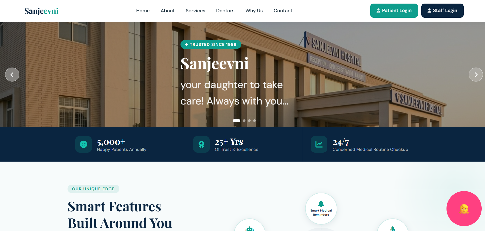
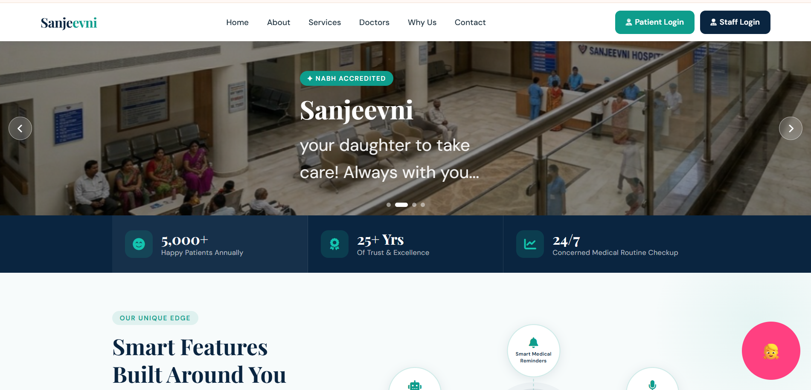
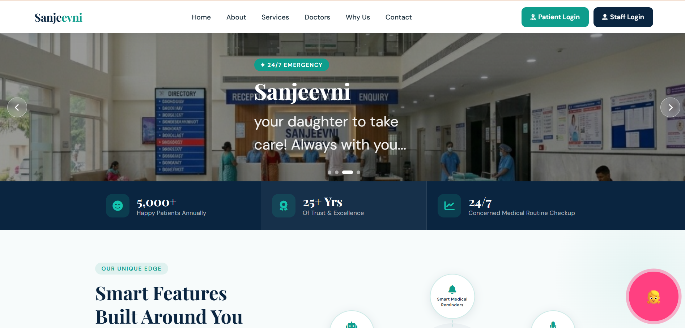
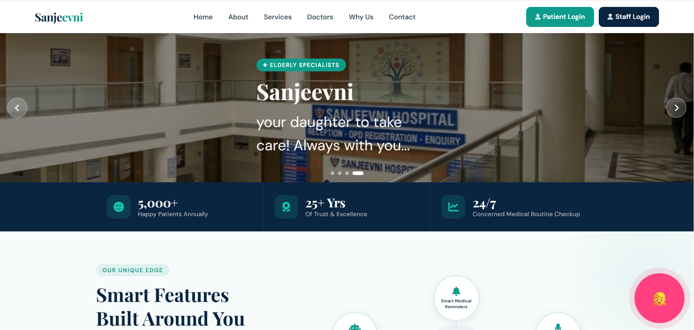

# 🏥 CareLink – Smart Post-Hospital Care System

## 🚨 Problem Statement
Elderly patients often face difficulties after hospital visits due to:
- Complex prescriptions
- Multiple medicines
- Memory-related issues
- Lack of continuous guidance

This leads to:
- Missed medicines
- Incorrect intake
- Skipped follow-ups
- Increased dependency on caregivers

## 💡 Solution: CareLink
CareLink is a patient-centric web platform that connects hospitals, doctors, and patients into a single digital care system.

It helps elderly patients:
- Understand prescriptions easily
- Get reminders for medicines
- Avoid missing doses
- Stay independent and safe

---

## 🔑 Key Features

### 👨‍💼 Employee Panel
- Register new patients
- Generate Patient ID
- View old patient records
- Generate initial prescription slip (A4 format)

### 👨‍⚕️ Doctor Panel
- Access patient details
- Add diagnosis and medicines
- Set medicine timings
- Generate final prescription

### 👴 Patient Panel
- Login using ID + OTP 
- View personal details
- View prescribed medicines
- Easy-to-use dashboard

### 🧾 Prescription System
- A4 format printable prescription
- Available after both:
  - Patient registration
  - Doctor consultation

---

## 🔄 System Workflow

1. Employee registers patient  
2. Patient ID is generated  
3. Doctor accesses patient data  
4. Doctor adds prescription  
5. Patient logs in and views details  
6. System ensures proper medicine tracking  

---
## 📸 Preview

## 👨‍⚕️ Doctor Dashboard

## 👤 Patient Dashboard

## 🔔 Notifications System

---

## 👩‍💻 Author
Developed as part of a hackathon project.

---

## ⭐ Final Note
CareLink aims to bridge the gap between hospitals and home care, ensuring that no patient misses their treatment after leaving the hospital.